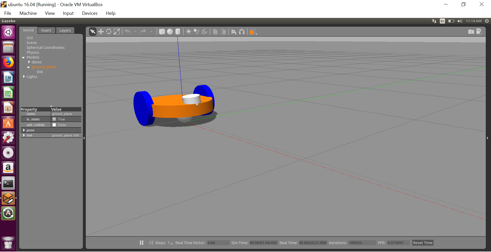

# OA-using-ros-and-gazebo

This is an obstacle avoiding bot which uses laser scanner to sense the surroundings and accordingly act to prevent a collision.
### About the project
The aim of the project is to simulate a 2 wheel differential drive robot to sense the obstacles in its path and change its direction accordingly.ROS and gazebo are used in this project. A urdf model is made of required bot.Then the laser scanner data is used and through python code the necessary instructions are givne to the bot.  

### Tech stack
* ROS

## Getting started
### Prerequisites
* ROS
### Installation
Clone the repository:
`git clone https://github.com/apte01/OA-using-ros-and-gazebo`

### Model of the differential robot with sensor

### Usage
To try this out you can run the obstacle_avoidance.py script after cloning the repository
`./obstacle_avoidance.py`

### Future scope
Currently the bot is just avoiding obstacles .So the next goal is to make the robot reach a particular destination along with avoiding the obstacles simultaneously.

### Troubleshooting
Every link in robot model must have an inertial tag otherwise the model will not be visible in gazebo.

### Acknowledgements and Resources
* [ROS Wiki](http://wiki.ros.org/Documentation)
* [theconstructsim](https://www.theconstructsim.com/)
* [gazebosim](http://gazebosim.org/)
